# DID Registry demo

A guide on how to interact with Fractal's [DID Registry](https://github.com/trustfractal/web3-identity#option-2-did-registry-lookup).

## ⚠️ Work in Progress ⚠️

We're still building this guide. If you need help today, get in touch through <sales@fractal.id>.

## Overview

To get our hands dirty with some mock data, we will:

- Deploy a mock version of Fractal's [DID Registry](https://github.com/trustfractal/web3-identity/blob/main/FractalRegistry.sol)
- Understand how Fractal operates this contract
- Create voting contract, and require its vote function to only be called once per person
- Create a buyable ERC20 token, and require its mint function to be called by KYC-approved addresses

This guide includes step-by-step demonstration sections. We encourage you to have a first shallow read, without going into the demonstrations, in order to familiarize yourself with the concepts. After that, go through the demonstrations, in order to get hands-on experience and build a strong intuition.

## Setup and deploy

For these demonstrations, we'll be using Remix IDE, which includes an in-browser Ethereum implementation, so we don't spend real money or have to chase down testnet faucets. However, don't worry, real-world operation is effectively identical, everything you'll see here can also be done with [Hardhat](https://hardhat.org/) or any other EVM toolchain you prefer.

<details>
  <summary>👁 Step-by-step demonstration</summary>

In order to make this guide accessible to non-blockchain developers, we've included step-by-step screenshots. If you're a blockchain developer and you're familiar with Remix IDE, feel free to skip these.

Let's get started! First off, let's start by deploying our own copy of a FractalRegistry.

- Go to [Remix IDE](https://remix.ethereum.org/) and clone this git repo as a workspace.

  <details>
    <summary>📸 Step-by-step screenshots</summary>

  - On your browser, go to `https://remix.ethereum.org/`. Accept or decline their analytics collection.

    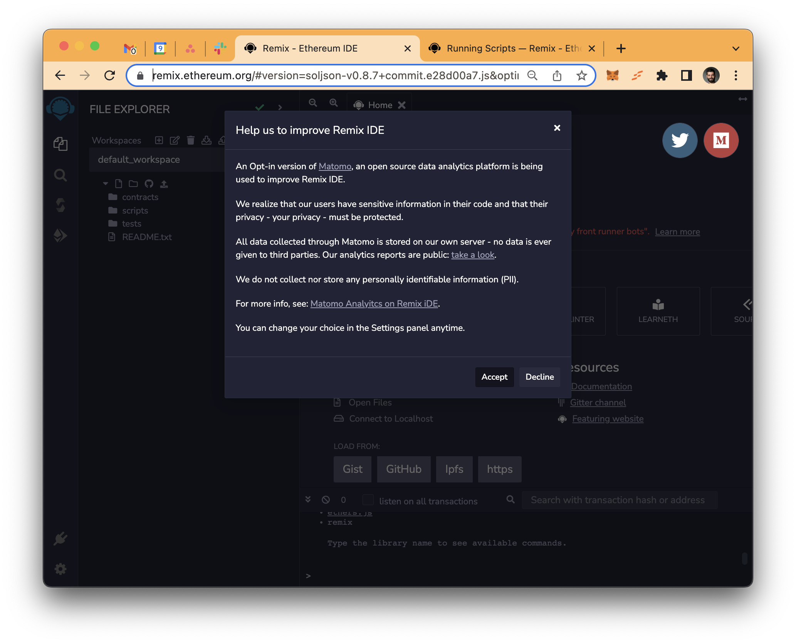

  - Click through the welcome wizard.

    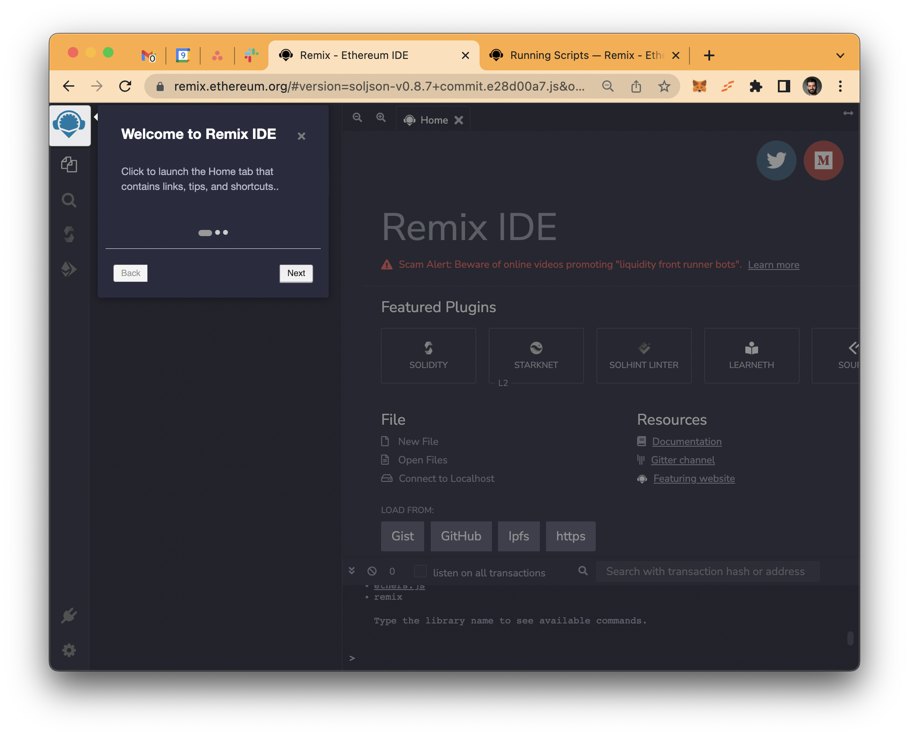

  - The Remix IDE should now be ready to be used. You should look like this:

    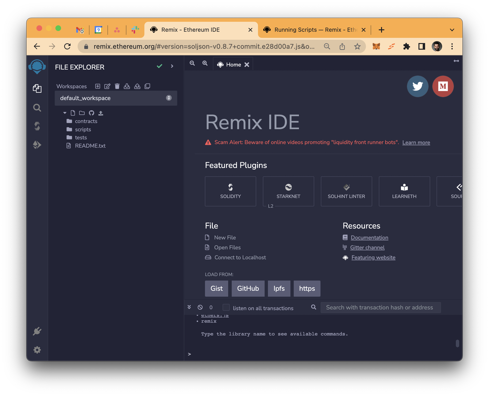

  - Click on "Clone Git Repository"

    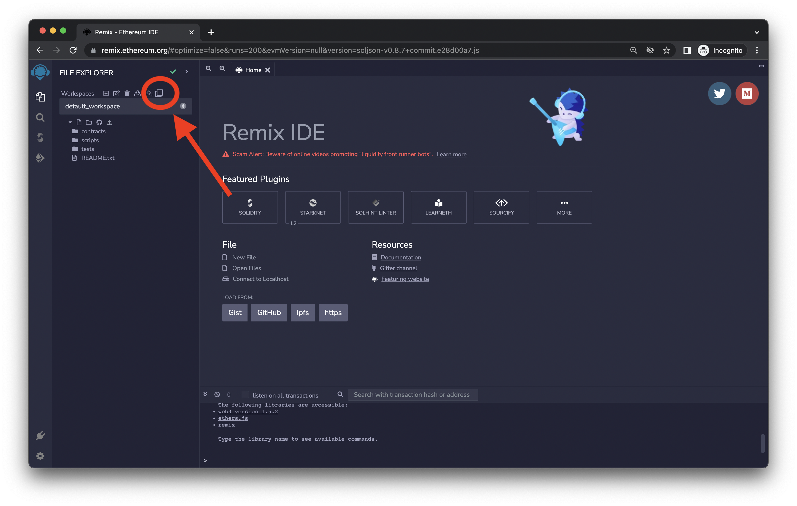

  - Input `https://github.com/trustfractal/did_registry_demo` and click "Ok"

    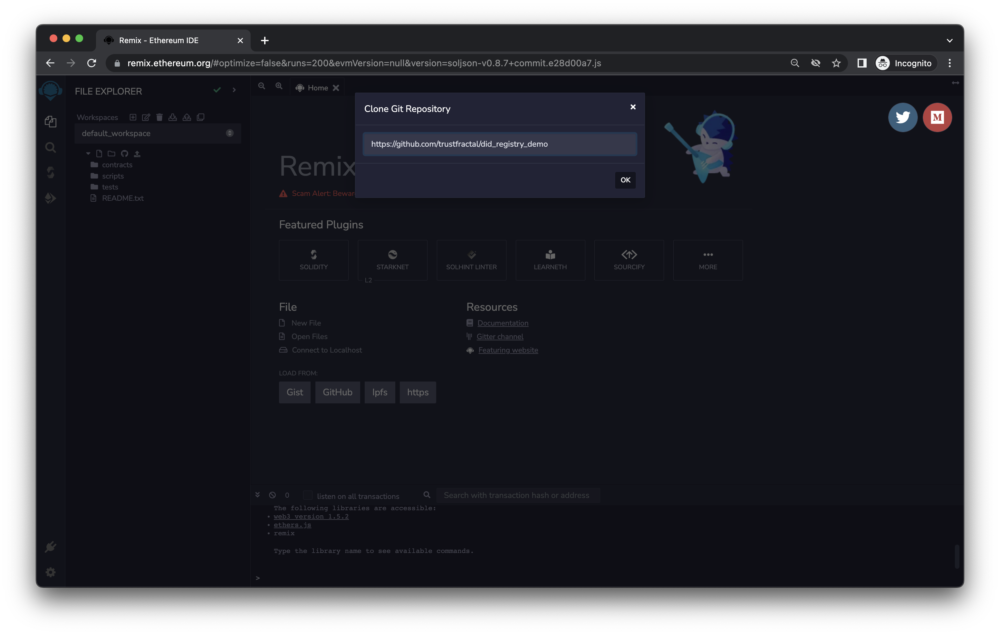

  - Remix will take a few seconds to do the clone. After it's done, you should see new files on the left bar:

    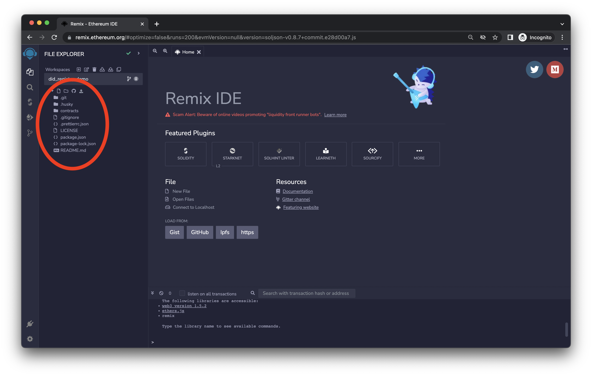

  </details>

- Compile and deploy the `contracts/1_FractalRegistry.sol` contract. Use your own address as `root`.

  <details>
    <summary>📸 Step-by-step screenshots</summary>

  - On the file browser on the left, click "contracts", and then "1_FractalRegistry.sol".

    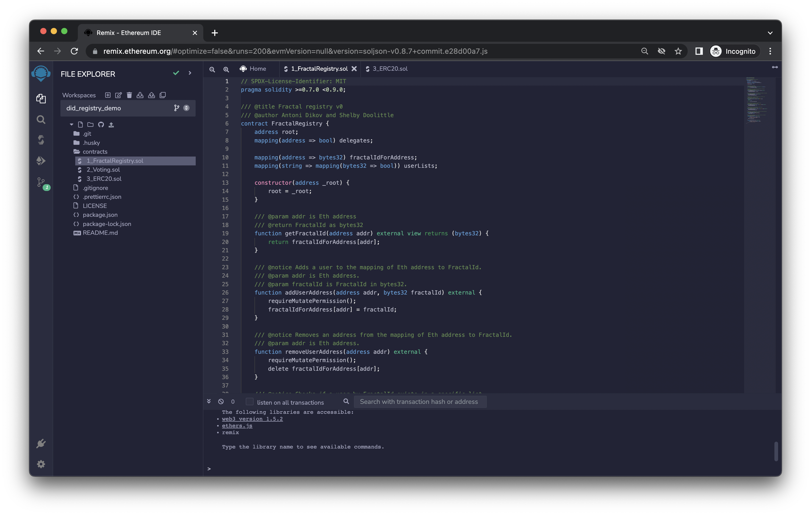

  - With that file open, click on the "Solidity compiler" tab

    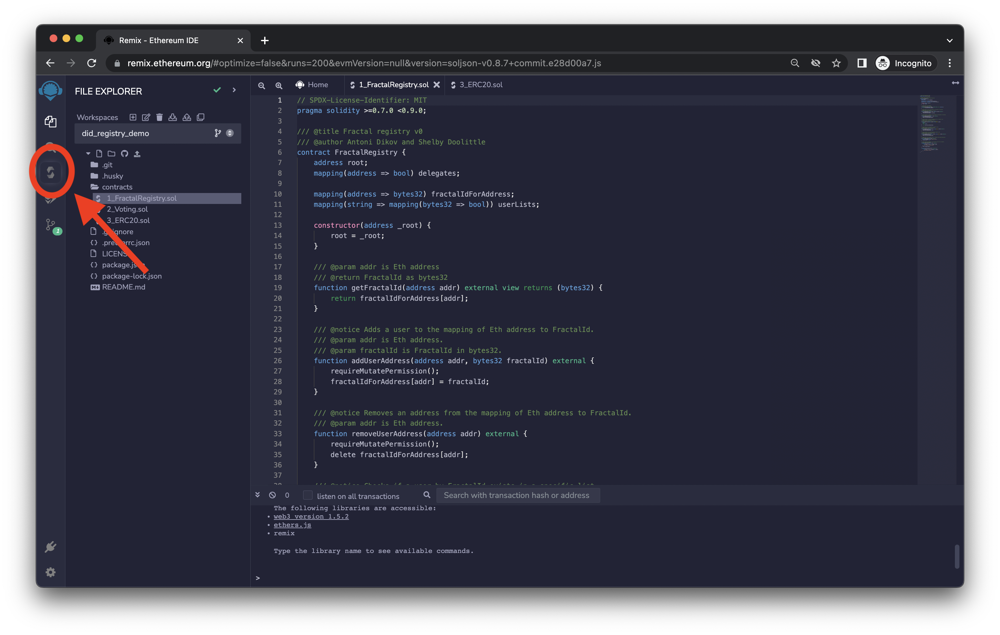

  - Click on the "Compile 01_FractalRegistry.sol" button

    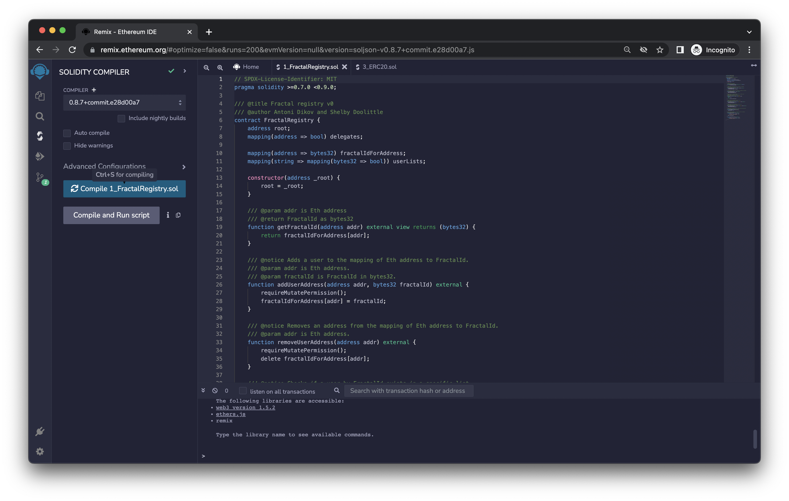

  - Everything should go well, and you should see a green checkmark on the tab

    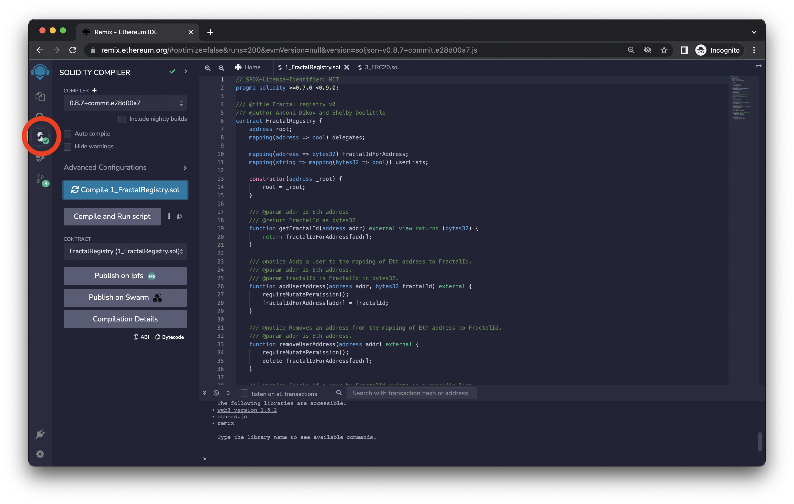

  - Next, click on the "Deploy & run transactions" tab

    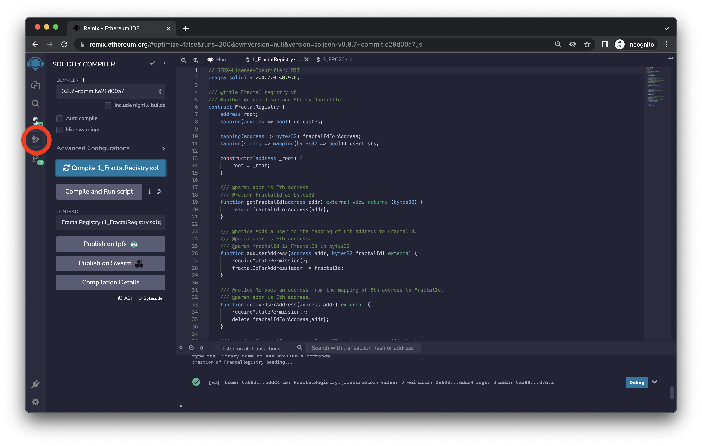

  - We're now going to deploy the contract we've just compiled. In order to do that, this specific contract needs to know who will be able to change its state. That's going to be the account we're currently using. Click on the "Copy account to clipboard" button.

    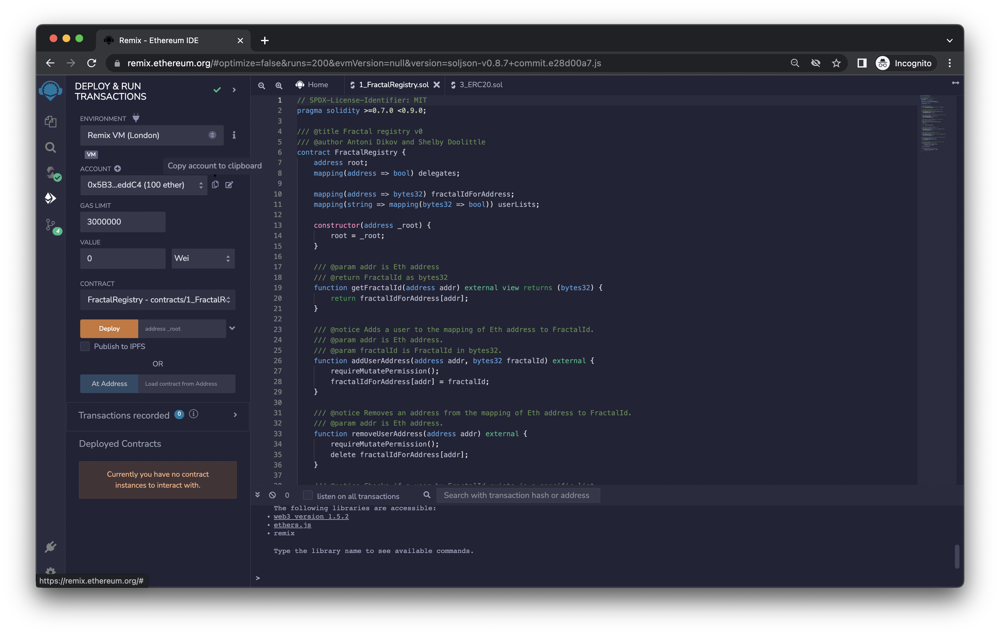

  - Paste it on the box to the right of the "Deploy" button, and press that button.

    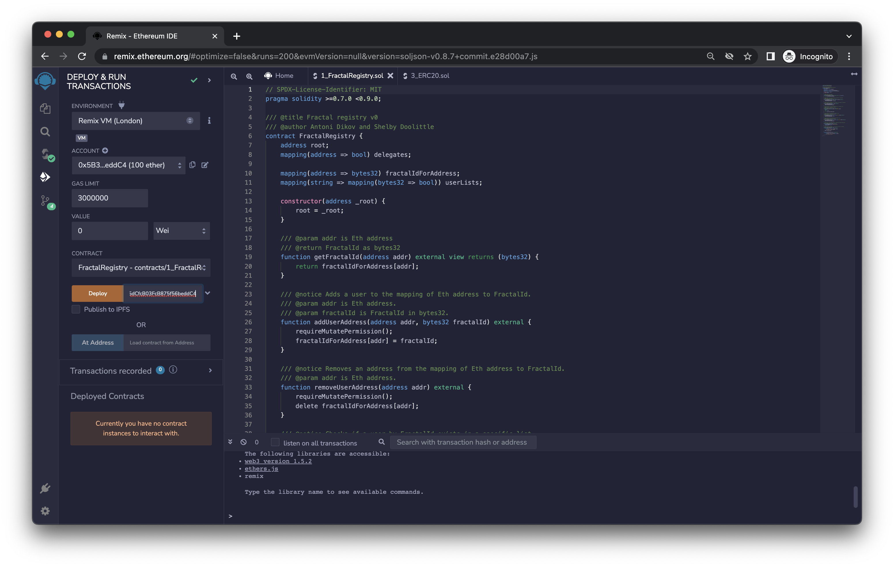

  - The contract is now deployed. You should be able to see three consequences:

    1. You should see a success message on the console on the bottom.
    2. Your account's balance went down a little bit. This is because it was spent as gas as part of the deployment.
    3. You should now have a contract entry on the bottom left.

      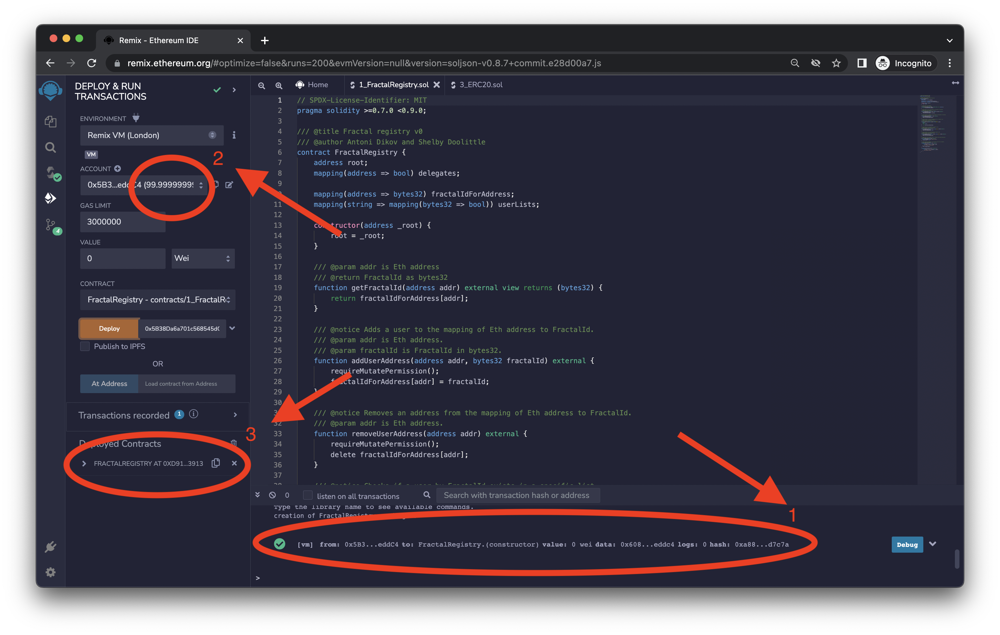

  We now have a working FractalRegistry deployment to play around with! 🎉

  </details>

</details>

## Operation of the contract

So, what does Fractal do with the contract? And, more importantly, what can we do with it?

### On user KYC approval

When a user submits their documents and our identity specialist verify their identity, if they've associated an EVM address with their account, our servers call `addUserAddress` with two arguments:

- the user's EVM address
- a personally unique identifier, called `fractalId`

<details>
  <summary>👁 Step-by-step demonstration</summary>

Let's use ourselves as an example. Let's pretend Fractal assigned us the `fractalId` of `0x0123456789ABCDEF0123456789ABCDEF0123456789ABCDEF0123456789ABCDEF`.

- Make a `addUserAddress` call with:
  - `addr`: our own address
  - `fractalId`: `0x0123456789ABCDEF0123456789ABCDEF0123456789ABCDEF0123456789ABCDEF`

  <details>
    <summary>📸 Step-by-step screenshots</summary>

    TODO-screenshots

  </details>

</details>

Fractal's servers also make a few `addUserToList` calls with the relevant lists. There are three categories of lists:

- KYC level

  There are two lists -- `basic` and `plus` -- which correspond to the [KYC levels](https://docs.developer.fractal.id/kyc-levels). If a user is in one of these two lists, they have passed the KYC checks for that level.

- Residency

  There's a list per country, with the format `residency_XX`, where `XX` is the [ISO 3166-1 alpha-2](https://en.wikipedia.org/wiki/ISO_3166-1_alpha-2) country code. For example, Spain has the code `es`, and there's a corresponding `residency_es` list. If a user is in one of these lists, Fractal has verified they reside in the respective country.

- Citizenship

  There's a list per country, with the format `citizenship_XX`, where `XX` is the [ISO 3166-1 alpha-2](https://en.wikipedia.org/wiki/ISO_3166-1_alpha-2) country code. For example, Italy has the code `it`, and there's a corresponding `citizenship_it` list. If a user is in one of these lists, Fractal has verified they are a citizen of the respective country.

<details>
  <summary>👁 Step-by-step demonstration</summary>

Let's pretend we're a Swedish citizen (`se`) living in the Åland Islands (`ax`) that has passed the Plus KYC level (`plus`).

- Make a `addUserToList` call with:

  - `userId`: `0x0123456789ABCDEF0123456789ABCDEF0123456789ABCDEF0123456789ABCDEF`
  - `listId`: `citizenship_se`

  <details>
    <summary>📸 Step-by-step screenshots</summary>

  TODO-screenshots

  </details>

- Make a `addUserToList` call with:

  - `userId`: `0x0123456789ABCDEF0123456789ABCDEF0123456789ABCDEF0123456789ABCDEF`
  - `listId`: `residency_ax`

  <details>
    <summary>📸 Step-by-step screenshots</summary>

  TODO-screenshots

  </details>

- Make a `addUserToList` call with:

  - `userId`: `0x0123456789ABCDEF0123456789ABCDEF0123456789ABCDEF0123456789ABCDEF`
  - `listId`: `plus`

  <details>
    <summary>📸 Step-by-step screenshots</summary>

  TODO-screenshots

  </details>

</details>

### Consulting state

With this data on the contract, we're now able to preform two operations: check if an address belongs to a unique user, and check which lists the users belongs to.

### User uniqueness

By calling `getFractalId` with an address, you get back its controlling user's `fractalId`. If two addresses return the same identifier, you can be sure they belong to the same person. Conversely, if two addresses return different identifiers, you can be sure they belong to different people.

If `getFractalId` returns `0`, that means the address isn't associated with any user known to Fractal. Be sure to check its return value!

<details>
  <summary>👁 Step-by-step demonstration</summary>

Let's see how to contract responds to querying for own address, and an arbitrary address that's not in the contract.

- Make a `getFractalId` call with:
  - `addr`: your own address
- Verify that you get our `fractalId` back.

  `0x0123456789ABCDEF0123456789ABCDEF0123456789ABCDEF0123456789ABCDEF`

  <details>
    <summary>📸 Step-by-step screenshots</summary>

  TODO-screenshots

  </details>

- Make a `getFractalId` call with:
  - `addr`: something arbitrary valid address. Here's an example: `0x05a56E2D52c817161883f50c441c3228CFe54d9f`
- Verify that you get back the "zero address":

  `0x0000000000000000000000000000000000000000000000000000000000000000`

  <details>
    <summary>📸 Step-by-step screenshots</summary>

  TODO-screenshots

  </details>

</details>

### KYC levels, residency, and citizenship

After you get the user's `fractalId`, you can then check their presence on the Registry's lists with `isUserInList`, which enables you to effectively check their KYC status, residency, and citizenship.

Here are a few examples:

```solidity
// Plus KYC level, and not resident in Fiji, and not a Iceland citizen.
registry.isUserInList(fractalId, "plus") &&
    !registry.isUserInList(fractalId, "residency_fj") &&
    !registry.isUserInList(fractalId, "citizenship_is")

// Basic KYC level, and resides in Portugal or Spain.
registry.isUserInList(fractalId, "basic") &&
    (
      registry.isUserInList(fractalId, "residency_pt") ||
      registry.isUserInList(fractalId, "residency_es")
    )

// Basic or Plus KYC level, no residency or citizenship requirements.
registry.isUserInList(fractalId, "basic") ||
    registry.isUserInList(fractalId, "plus")
```

<details>
  <summary>👁 Step-by-step demonstration</summary>

Let's see how to contract responds to querying for own lists, and an some other arbitrary ones.

- Make a `isUserInList` call with:
  - `userId`: `0x0123456789ABCDEF0123456789ABCDEF0123456789ABCDEF0123456789ABCDEF`
  - `listId`: `citizenship_se`
- Verify that you get back `true`.

  <details>
    <summary>📸 Step-by-step screenshots</summary>

  TODO-screenshots

  </details>

- Make a `isUserInList` call with:
  - `userId`: `0x0123456789ABCDEF0123456789ABCDEF0123456789ABCDEF0123456789ABCDEF`
  - `listId`: `residency_ax`
- Verify that you get back `true`.

  <details>
    <summary>📸 Step-by-step screenshots</summary>

  TODO-screenshots

  </details>

- Make a `isUserInList` call with:
  - `userId`: `0x0123456789ABCDEF0123456789ABCDEF0123456789ABCDEF0123456789ABCDEF`
  - `listId`: `citizenship_dk`
- Verify that you get back `false`.

  <details>
    <summary>📸 Step-by-step screenshots</summary>

  TODO-screenshots

  </details>

- Make a `isUserInList` call with:
  - `userId`: `0x0123456789ABCDEF0123456789ABCDEF0123456789ABCDEF0123456789ABCDEF`
  - `listId`: `residency_fi`
- Verify that you get back `false`.

  <details>
    <summary>📸 Step-by-step screenshots</summary>

  TODO-screenshots

  </details>

</details>

### On user change or document expiration

There's two other relevant public functions on the contract. Going over them briefly:

- When a user removes (or changes) their associated EVM address, Fractal's servers call `removeUserAddress` appropriately (and, on change, also call `addUserAddress`).
- When a user submits new information that changes their KYC, residency, or citizenship status, Fractal's servers will make the appropriate `removeUserFromList` (and possibly `addUserToList`) calls to keep the user's on-chain information up-to-date.

## Usage examples

### One person, one vote

An example use case of `fractalId`'s pre-person uniqueness is having a voting contract where you require the voter to be in the Registry and for a person to only be able to cast one vote.

Here's a simplified example:

```solidity
function vote(uint8 option) external {
    bytes32 fractalId = FractalRegistry(OXADDRESS).getFractalId(msg.sender);
    require(fractalId != 0, "User must be present in FractalRegistry.");
    require(!hasVoted[fractalId], "Same person can't vote twice.");

    hasVoted[fractalId] = true;
    votes[option] += 1;
}
```

<details>
  <summary>👁 Step-by-step demonstration</summary>

TODO-steps
TODO-screenshots

TODO get this out into its own JS file to make it less tedious? 🫥

</details>

### Require KYC approval

An example use case of `fractalId` presence in specific lists is checking whether a user has passed KYC, and if they're of a particular residency or citizenship.

Here's a simplified example:

```solidity
function buy() external payable {
  FractalRegistry registry = FractalRegistry(OXADDRESS);
  bytes32 fractalId = registry.getFractalId(msg.sender);
  require(
      fractalId != 0 &&
          registry.isUserInList(fractalId, "plus") &&
          !registry.isUserInList(fractalId, "residency_fj") &&
          !registry.isUserInList(fractalId, "citizenship_is"),
      "Non KYC-compliant sender. "
        "Must have cleared `plus` level, "
        "not reside in Fiji, and "
        "not be a Iceland citizen"
  );

  _mint(msg.sender, msg.value);
};
```

<details>
  <summary>👁 Step-by-step demonstration</summary>

TODO-steps
TODO-screenshots

TODO get this out into its own JS file to make it less tedious? 🫥

</details>

### Using client-side JavaScript

Since the main goal of the DID Registry is to be a readable resource, you can also use it off chain directly from your dApp's code!

> ⚠️ TODO Add a brief web3.js example.

> ⚠️ TODO Add contract addresses (for the various networks) and ABI.

> ⚠️ TODO Add link to a demo app.
